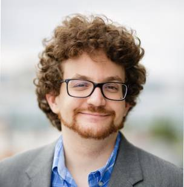

# Keynote talk

## Speaker:

Bryce Adelstein Lelbach, NVIDIA

Bryce Adelstein Lelbach has spent over a decade developing programming languages and software libraries. He is the HPC Programming Models Architect at NVIDIA, where he leads programming language standardization efforts and drives the technical roadmap for NVIDIA's HPC compilers and libraries. Bryce is passionate about C++ and is one of the leaders of the C++ community. He is the chair of INCITS/PL22, the US standards committee for programming languages, and the Standard C++ Library Evolution group. He also serves as editor for the INCITS Inclusive Terminology Guidelines. Bryce is the program chair for the C++Now and CppCon conferences. On the C++ Committee, he has personally worked on concurrency primitives, parallel algorithms, executors, and multidimensional arrays. He is one of the founding developers of the HPX parallel runtime system.

 
**C++ Standard Parallelism**

Imagine writing parallel code that can run on any platform - CPUs, GPUs, DPUs, specialized accelerators, etc - without any language or vendor extensions, external libraries, or special compilation tools. It's no longer just a dream - you can do it today in Standard C++!

Parallelism is increasingly common in software, from supercomputer simulations to mobile applications. But writing parallel code is increasingly challenging due to an explosion of diversity in hardware, a trend that's likely to continue into the future. To meet this challenge, the C++ Committee has developed C++ Standard Parallelism, a parallel programming model for Standard C++ that is portable to all platforms, from your smartwatch to your supercomputer, and delivers reasonable performance and efficiency for most use cases.

Our vision of C++ Standard Parallelism consists of three key components:

* Common parallel algorithms that dispatch to vendor-optimized parallel libraries
* Tools to write your own parallel algorithms that run anywhere.
* Mechanisms for composing parallel invocations of algorithms into task graphs.

In this talk, we'll dive into the roadmap for C++ Standard Parallelism - we'll discuss what we already have that you can use today, what's coming down the line, and where the future may lead us.
